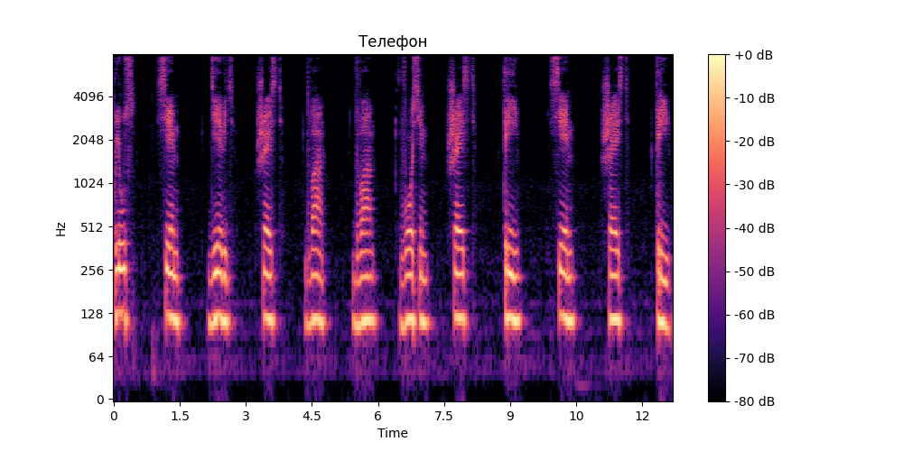

# Лабораторная работа №10

---

## Обработка голоса. Анализатор речи

**Вариант 3**

---

### Цель работы: 

Распознать дорожку с номером телефона в ограниченном словаре.

Исходный словарь: цифры от 0 до 9, а также символ плюс.

---

### Предобработка аудио

Каждый файл приводится к единому формату: моно, частота дискретизации 16000 Гц, нормализация амплитуды, удаление начальных и конечных участков тишины.

---

### Спектограмма записи телефонного номера

---

### Результаты:

Исходная последовательность: **+79622863763**

Распознанная последовательность: **+79622863763**

Суммарное число ошибок - **0**

Достоверность - **100.0 %**

---

### Вывод

В ходе работы была реализована система распознавания речи на основе:

- спектральных признаков (MFCC)
- алгоритма DTW
- сегментации аудиосигнала

Были решены основные проблемы:

- нормализация аудио
- корректная сегментация
- повышение качества распознавания

Разработанная система успешно распознаёт последовательность слов и позволяет оценить точность распознавания.
