# Лабораторная работа №5

## Выделение признаков символов

**Вариант:** 1  
**Алфавит:** арабский  
**Шрифт:** Times New Roman  
**Кегль:** 52  

---

## Результаты

### Символ 1 — أ

**Изображение символа:**

**Скалярные характеристики:**

| Признак | Значение |
|---|---:|
| Вес 1-й четверти | 31 |
| Вес 2-й четверти | 18 |
| Вес 3-й четверти | 9 |
| Вес 4-й четверти | 41 |
| Удельный вес 1-й четверти | 0.543860 |
| Удельный вес 2-й четверти | 0.315789 |
| Удельный вес 3-й четверти | 0.157895 |
| Удельный вес 4-й четверти | 0.719298 |
| Координата центра тяжести X | 2.727273 |
| Координата центра тяжести Y | 18.272727 |
| Нормированная координата X | 0.545455 |
| Нормированная координата Y | 0.493857 |
| Осевой момент инерции Ix | 10901.636364 |
| Осевой момент инерции Iy | 137.636364 |
| Нормированный момент инерции Ix | 47.814195 |
| Нормированный момент инерции Iy | 0.603668 |

**Профиль X:**

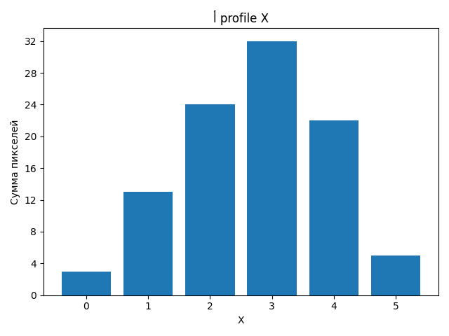

**Профиль Y:**

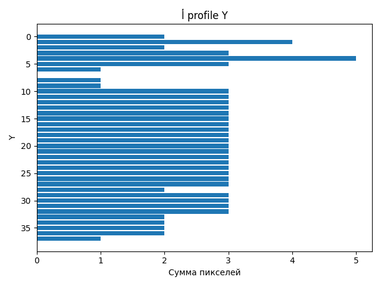

---

### Символ 2 — ب

**Изображение символа:**

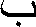

**Скалярные характеристики:**

| Признак | Значение |
|---|---:|
| Вес 1-й четверти | 29 |
| Вес 2-й четверти | 32 |
| Вес 3-й четверти | 62 |
| Вес 4-й четверти | 83 |
| Удельный вес 1-й четверти | 0.123932 |
| Удельный вес 2-й четверти | 0.136752 |
| Удельный вес 3-й четверти | 0.246032 |
| Удельный вес 4-й четверти | 0.329365 |
| Координата центра тяжести X | 19.203883 |
| Координата центра тяжести Y | 13.058252 |
| Нормированная координата X | 0.548682 |
| Нормированная координата Y | 0.502240 |
| Осевой момент инерции Ix | 5351.300971 |
| Осевой момент инерции Iy | 25873.436893 |
| Нормированный момент инерции Ix | 5.505454 |
| Нормированный момент инерции Iy | 26.618762 |

**Профиль X:**

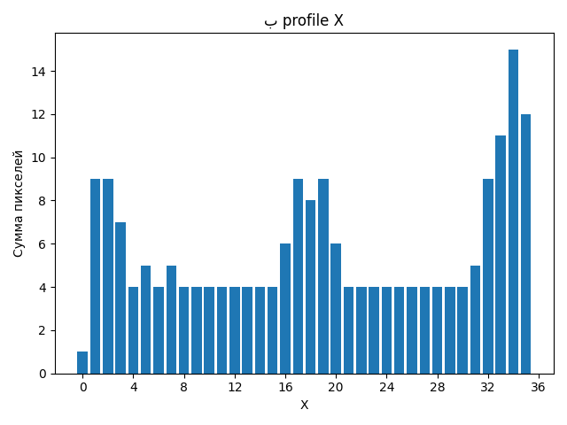

**Профиль Y:**

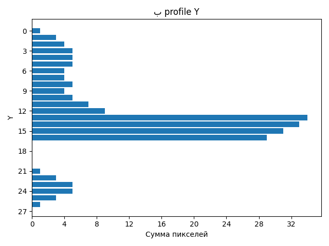

---

### Символ 3 — ج

**Изображение символа:**

**Скалярные характеристики:**

| Признак | Значение |
|---|---:|
| Вес 1-й четверти | 70 |
| Вес 2-й четверти | 74 |
| Вес 3-й четверти | 65 |
| Вес 4-й четверти | 55 |
| Удельный вес 1-й четверти | 0.364583 |
| Удельный вес 2-й четверти | 0.355769 |
| Удельный вес 3-й четверти | 0.318627 |
| Удельный вес 4-й четверти | 0.248869 |
| Координата центра тяжести X | 11.056818 |
| Координата центра тяжести Y | 14.515152 |
| Нормированная координата X | 0.460701 |
| Нормированная координата Y | 0.453598 |
| Осевой момент инерции Ix | 38357.939394 |
| Осевой момент инерции Iy | 10822.147727 |
| Нормированный момент инерции Ix | 46.494472 |
| Нормированный момент инерции Iy | 13.117755 |

**Профиль X:**

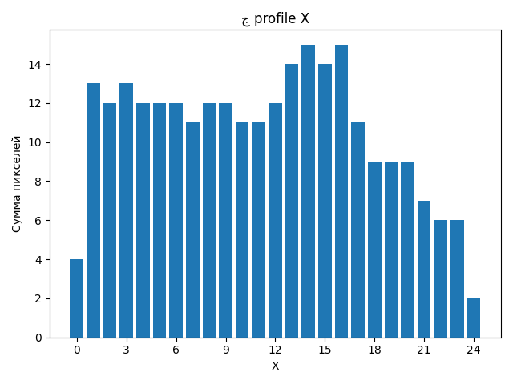

**Профиль Y:**

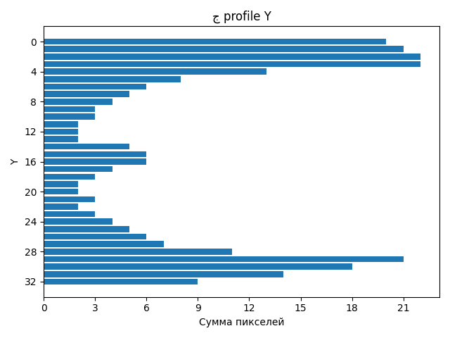

---

### Символ 4 — د

**Изображение символа:**

**Скалярные характеристики:**

| Признак | Значение |
|---|---:|
| Вес 1-й четверти | 0 |
| Вес 2-й четверти | 27 |
| Вес 3-й четверти | 31 |
| Вес 4-й четверти | 40 |
| Удельный вес 1-й четверти | 0.000000 |
| Удельный вес 2-й четверти | 0.337500 |
| Удельный вес 3-й четверти | 0.387500 |
| Удельный вес 4-й четверти | 0.500000 |
| Координата центра тяжести X | 9.040816 |
| Координата центра тяжести Y | 13.418367 |
| Нормированная координата X | 0.602721 |
| Нормированная координата Y | 0.706230 |
| Осевой момент инерции Ix | 3399.846939 |
| Осевой момент инерции Iy | 1797.836735 |
| Нормированный момент инерции Ix | 10.624522 |
| Нормированный момент инерции Iy | 5.618240 |

**Профиль X:**

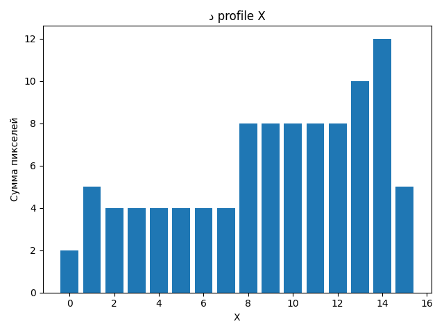

**Профиль Y:**

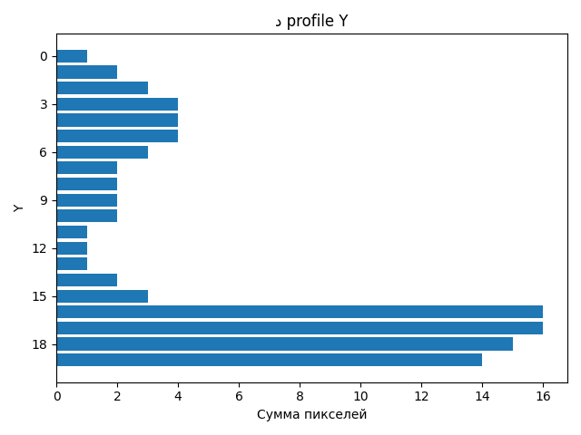

---

### Символ 5 — ﻩ

**Изображение символа:**

**Скалярные характеристики:**

| Признак | Значение |
|---|---:|
| Вес 1-й четверти | 18 |
| Вес 2-й четверти | 23 |
| Вес 3-й четверти | 30 |
| Вес 4-й четверти | 30 |
| Удельный вес 1-й четверти | 0.428571 |
| Удельный вес 2-й четверти | 0.469388 |
| Удельный вес 3-й четверти | 0.625000 |
| Удельный вес 4-й четверти | 0.535714 |
| Координата центра тяжести X | 5.881188 |
| Координата центра тяжести Y | 7.950495 |
| Нормированная координата X | 0.490099 |
| Нормированная координата Y | 0.567893 |
| Осевой момент инерции Ix | 1646.752475 |
| Осевой момент инерции Iy | 1068.574257 |
| Нормированный момент инерции Ix | 8.444884 |
| Нормированный момент инерции Iy | 5.479868 |

**Профиль X:**

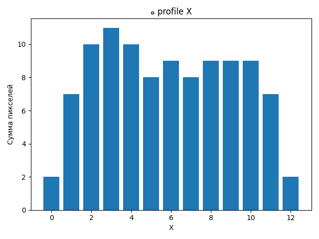

**Профиль Y:**

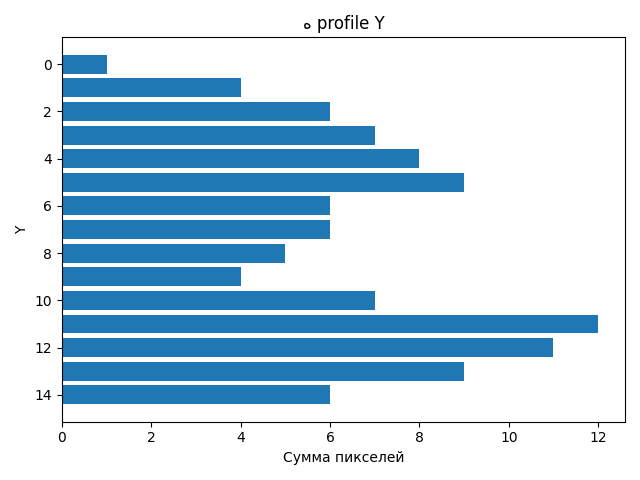

---

### Символ 6 — و

**Изображение символа:**

**Скалярные характеристики:**

| Признак | Значение |
|---|---:|
| Вес 1-й четверти | 0 |
| Вес 2-й четверти | 69 |
| Вес 3-й четверти | 24 |
| Вес 4-й четверти | 48 |
| Удельный вес 1-й четверти | 0.000000 |
| Удельный вес 2-й четверти | 0.575000 |
| Удельный вес 3-й четверти | 0.200000 |
| Удельный вес 4-й четверти | 0.400000 |
| Координата центра тяжести X | 13.581560 |
| Координата центра тяжести Y | 12.617021 |
| Нормированная координата X | 0.714819 |
| Нормированная координата Y | 0.548566 |
| Осевой момент инерции Ix | 7701.319149 |
| Осевой момент инерции Iy | 2912.312057 |
| Нормированный момент инерции Ix | 16.044415 |
| Нормированный момент инерции Iy | 6.067317 |

**Профиль X:**

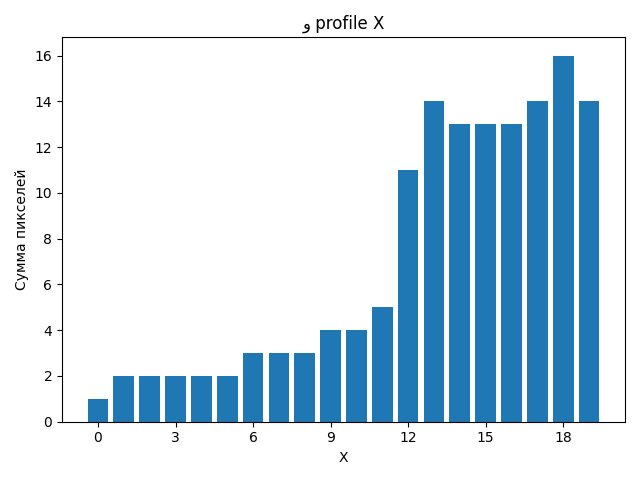

**Профиль Y:**

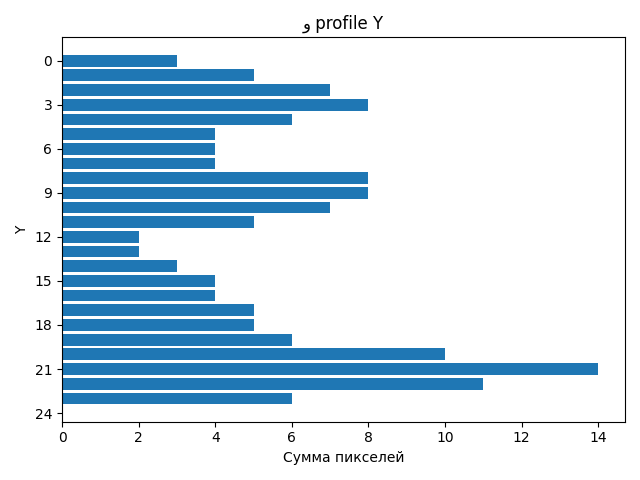

---

### Символ 7 — ز

**Изображение символа:**

**Скалярные характеристики:**

| Признак | Значение |
|---|---:|
| Вес 1-й четверти | 0 |
| Вес 2-й четверти | 43 |
| Вес 3-й четверти | 23 |
| Вес 4-й четверти | 67 |
| Удельный вес 1-й четверти | 0.000000 |
| Удельный вес 2-й четверти | 0.188596 |
| Удельный вес 3-й четверти | 0.110048 |
| Удельный вес 4-й четверти | 0.293860 |
| Координата центра тяжести X | 15.827068 |
| Координата центра тяжести Y | 24.375940 |
| Нормированная координата X | 0.719412 |
| Нормированная координата Y | 0.658809 |
| Осевой момент инерции Ix | 17371.203008 |
| Осевой момент инерции Iy | 3911.022556 |
| Нормированный момент инерции Ix | 19.875518 |
| Нормированный момент инерции Iy | 4.474854 |

**Профиль X:**

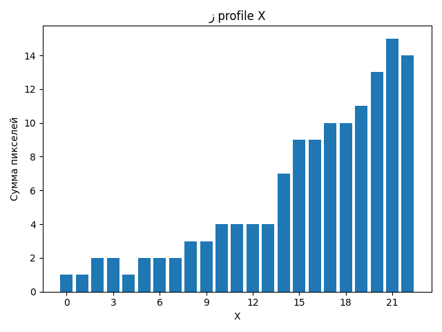

**Профиль Y:**

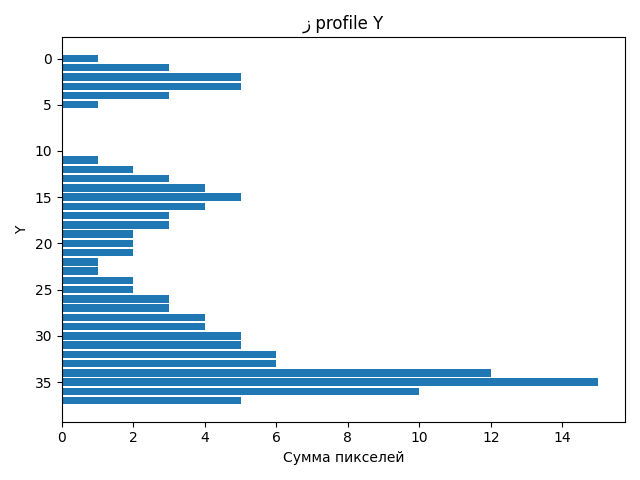

---

### Символ 8 — ح

**Изображение символа:**

**Скалярные характеристики:**

| Признак | Значение |
|---|---:|
| Вес 1-й четверти | 70 |
| Вес 2-й четверти | 65 |
| Вес 3-й четверти | 65 |
| Вес 4-й четверти | 46 |
| Удельный вес 1-й четверти | 0.364583 |
| Удельный вес 2-й четверти | 0.312500 |
| Удельный вес 3-й четверти | 0.318627 |
| Удельный вес 4-й четверти | 0.208145 |
| Координата центра тяжести X | 10.768293 |
| Координата центра тяжести Y | 14.443089 |
| Нормированная координата X | 0.448679 |
| Нормированная координата Y | 0.451347 |
| Осевой момент инерции Ix | 38310.703252 |
| Осевой момент инерции Iy | 10495.792683 |
| Нормированный момент инерции Ix | 46.437216 |
| Нормированный момент инерции Iy | 12.722173 |

**Профиль X:**

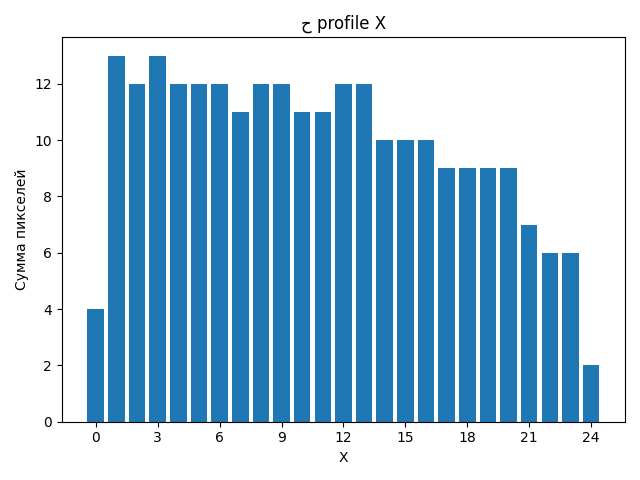

**Профиль Y:**

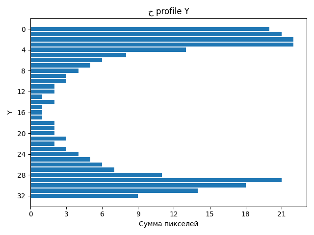

---

### Символ 9 — ط

**Изображение символа:**

**Скалярные характеристики:**

| Признак | Значение |
|---|---:|
| Вес 1-й четверти | 51 |
| Вес 2-й четверти | 0 |
| Вес 3-й четверти | 103 |
| Вес 4-й четверти | 140 |
| Удельный вес 1-й четверти | 0.199219 |
| Удельный вес 2-й четверти | 0.000000 |
| Удельный вес 3-й четверти | 0.378676 |
| Удельный вес 4-й четверти | 0.514706 |
| Координата центра тяжести X | 16.727891 |
| Координата центра тяжести Y | 23.503401 |
| Нормированная координата X | 0.539609 |
| Нормированная координата Y | 0.734481 |
| Осевой момент инерции Ix | 23007.496599 |
| Осевой момент инерции Iy | 20562.231293 |
| Нормированный момент инерции Ix | 21.787402 |
| Нормированный момент инерции Iy | 19.471810 |

**Профиль X:**

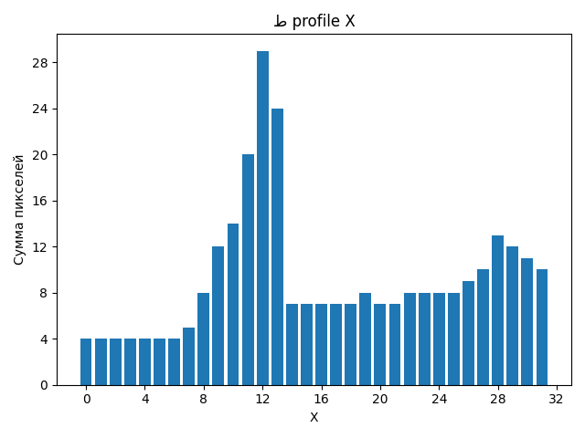

**Профиль Y:**

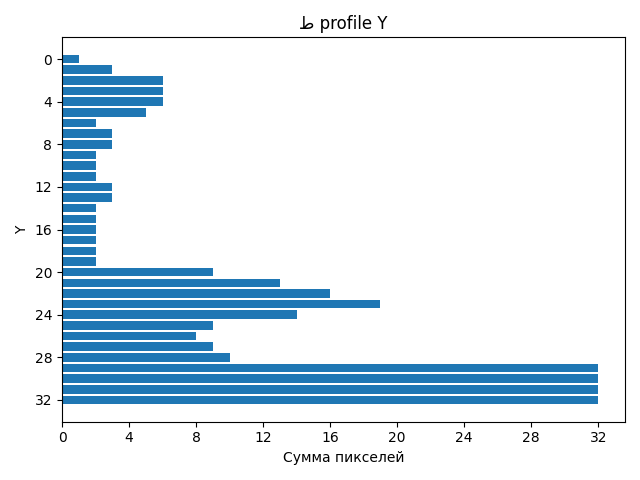

---

### Символ 10 — ي

**Изображение символа:**

**Скалярные характеристики:**

| Признак | Значение |
|---|---:|
| Вес 1-й четверти | 16 |
| Вес 2-й четверти | 97 |
| Вес 3-й четверти | 88 |
| Вес 4-й четверти | 74 |
| Удельный вес 1-й четверти | 0.062745 |
| Удельный вес 2-й четверти | 0.380392 |
| Удельный вес 3-й четверти | 0.325926 |
| Удельный вес 4-й четверти | 0.274074 |
| Координата центра тяжести X | 16.007273 |
| Координата центра тяжести Y | 17.967273 |
| Нормированная координата X | 0.551975 |
| Нормированная координата Y | 0.528449 |
| Осевой момент инерции Ix | 20614.705455 |
| Осевой момент инерции Iy | 19053.985455 |
| Нормированный момент инерции Ix | 19.633053 |
| Нормированный момент инерции Iy | 18.146653 |

**Профиль X:**

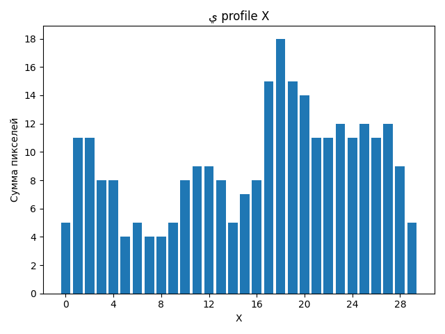

**Профиль Y:**

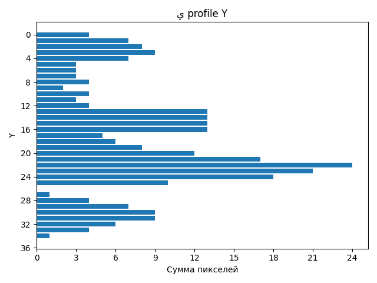

---

### Символ 11 — ك

**Изображение символа:**

**Скалярные характеристики:**

| Признак | Значение |
|---|---:|
| Вес 1-й четверти | 10 |
| Вес 2-й четверти | 84 |
| Вес 3-й четверти | 81 |
| Вес 4-й четверти | 121 |
| Удельный вес 1-й четверти | 0.039216 |
| Удельный вес 2-й четверти | 0.329412 |
| Удельный вес 3-й четверти | 0.317647 |
| Удельный вес 4-й четверти | 0.474510 |
| Координата центра тяжести X | 18.189189 |
| Координата центра тяжести Y | 21.851351 |
| Нормированная координата X | 0.627213 |
| Нормированная координата Y | 0.662162 |
| Осевой момент инерции Ix | 27603.459459 |
| Осевой момент инерции Iy | 20825.405405 |
| Нормированный момент инерции Ix | 27.062215 |
| Нормированный момент инерции Iy | 20.417064 |

**Профиль X:**

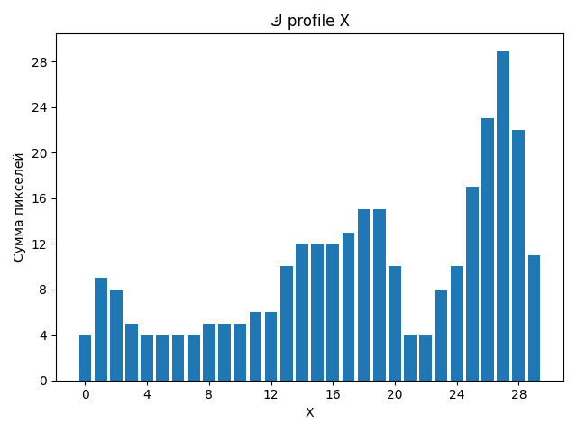

**Профиль Y:**

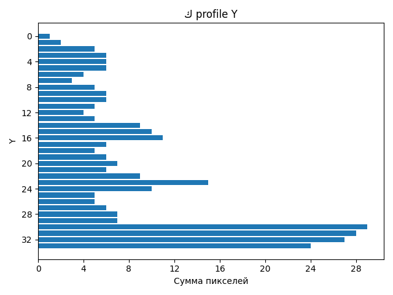

---

### Символ 12 — ل

**Изображение символа:**

**Скалярные характеристики:**

| Признак | Значение |
|---|---:|
| Вес 1-й четверти | 1 |
| Вес 2-й четверти | 61 |
| Вес 3-й четверти | 72 |
| Вес 4-й четверти | 78 |
| Удельный вес 1-й четверти | 0.004167 |
| Удельный вес 2-й четверти | 0.254167 |
| Удельный вес 3-й четверти | 0.285714 |
| Удельный вес 4-й четверти | 0.309524 |
| Координата центра тяжести X | 14.452830 |
| Координата центра тяжести Y | 26.141509 |
| Нормированная координата X | 0.628384 |
| Нормированная координата Y | 0.653538 |
| Осевой момент инерции Ix | 34763.754717 |
| Осевой момент инерции Iy | 13658.528302 |
| Нормированный момент инерции Ix | 35.329019 |
| Нормированный момент инерции Iy | 13.880618 |

**Профиль X:**

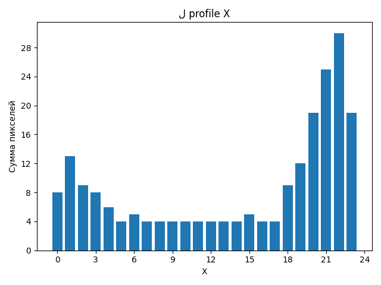

**Профиль Y:**

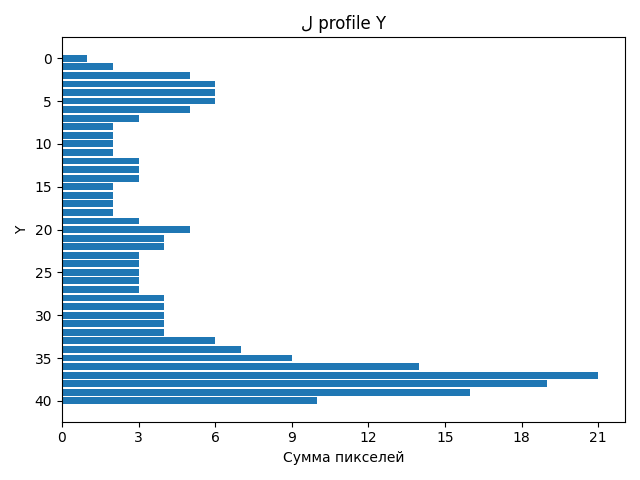

---

### Символ 13 — م

**Изображение символа:**

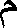

**Скалярные характеристики:**

| Признак | Значение |
|---|---:|
| Вес 1-й четверти | 44 |
| Вес 2-й четверти | 69 |
| Вес 3-й четверти | 28 |
| Вес 4-й четверти | 0 |
| Удельный вес 1-й четверти | 0.392857 |
| Удельный вес 2-й четверти | 0.547619 |
| Удельный вес 3-й четверти | 0.250000 |
| Удельный вес 4-й четверти | 0.000000 |
| Координата центра тяжести X | 7.347518 |
| Координата центра тяжести Y | 9.375887 |
| Нормированная координата X | 0.459220 |
| Нормированная координата Y | 0.347255 |
| Осевой момент инерции Ix | 5679.078014 |
| Осевой момент инерции Iy | 3129.971631 |
| Нормированный момент инерции Ix | 11.930836 |
| Нормированный момент инерции Iy | 6.575571 |

**Профиль X:**

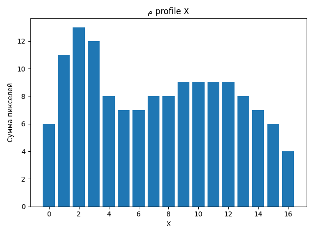

**Профиль Y:**

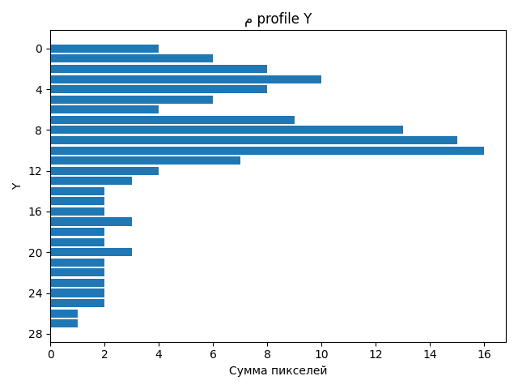

---

### Символ 14 — ن

**Изображение символа:**

**Скалярные характеристики:**

| Признак | Значение |
|---|---:|
| Вес 1-й четверти | 10 |
| Вес 2-й четверти | 37 |
| Вес 3-й четверти | 68 |
| Вес 4-й четверти | 74 |
| Удельный вес 1-й четверти | 0.049020 |
| Удельный вес 2-й четверти | 0.167421 |
| Удельный вес 3-й четверти | 0.333333 |
| Удельный вес 4-й четверти | 0.334842 |
| Координата центра тяжести X | 13.116402 |
| Координата центра тяжести Y | 22.984127 |
| Нормированная координата X | 0.546517 |
| Нормированная координата Y | 0.696489 |
| Осевой момент инерции Ix | 17374.952381 |
| Осевой момент инерции Iy | 12801.439153 |
| Нормированный момент инерции Ix | 20.441120 |
| Нормированный момент инерции Iy | 15.060517 |

**Профиль X:**

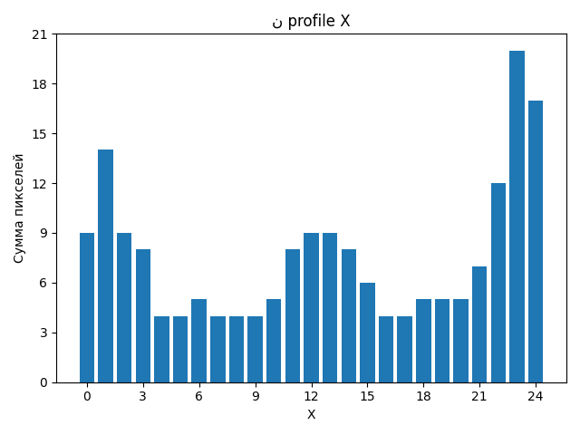

**Профиль Y:**

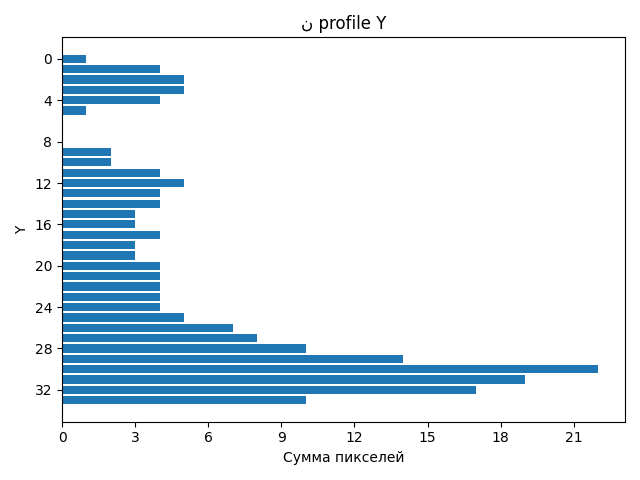

---

### Символ 15 — س

**Изображение символа:**

**Скалярные характеристики:**

| Признак | Значение |
|---|---:|
| Вес 1-й четверти | 12 |
| Вес 2-й четверти | 100 |
| Вес 3-й четверти | 93 |
| Вес 4-й четверти | 51 |
| Удельный вес 1-й четверти | 0.050000 |
| Удельный вес 2-й четверти | 0.396825 |
| Удельный вес 3-й четверти | 0.357692 |
| Удельный вес 4-й четверти | 0.186813 |
| Координата центра тяжести X | 20.789062 |
| Координата центра тяжести Y | 13.417969 |
| Нормированная координата X | 0.519727 |
| Нормированная координата Y | 0.559082 |
| Осевой момент инерции Ix | 12214.277344 |
| Осевой момент инерции Iy | 41802.609375 |
| Нормированный момент инерции Ix | 11.916368 |
| Нормированный момент инерции Iy | 40.783034 |

**Профиль X:**

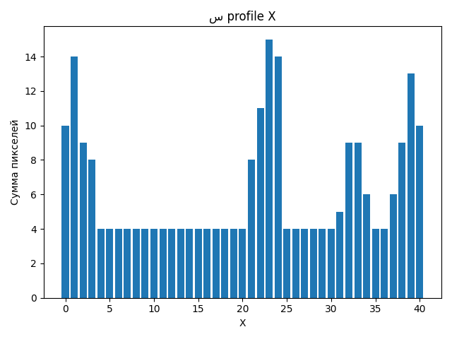

**Профиль Y:**

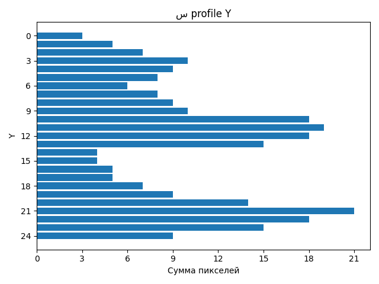

---

### Символ 16 — ع

**Изображение символа:**

**Скалярные характеристики:**

| Признак | Значение |
|---|---:|
| Вес 1-й четверти | 121 |
| Вес 2-й четверти | 42 |
| Вес 3-й четверти | 80 |
| Вес 4-й четверти | 43 |
| Удельный вес 1-й четверти | 0.504167 |
| Удельный вес 2-й четверти | 0.161538 |
| Удельный вес 3-й четверти | 0.317460 |
| Удельный вес 4-й четверти | 0.157509 |
| Координата центра тяжести X | 8.405594 |
| Координата центра тяжести Y | 20.059441 |
| Нормированная координата X | 0.350233 |
| Нормированная координата Y | 0.501486 |
| Осевой момент инерции Ix | 50855.989510 |
| Осевой момент инерции Iy | 10148.951049 |
| Нормированный момент инерции Ix | 49.615600 |
| Нормированный момент инерции Iy | 9.901416 |

**Профиль X:**

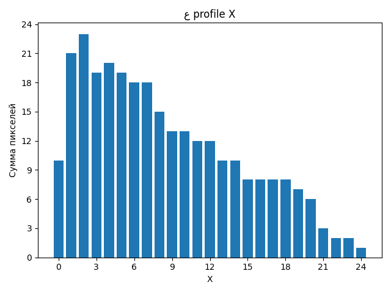

**Профиль Y:**

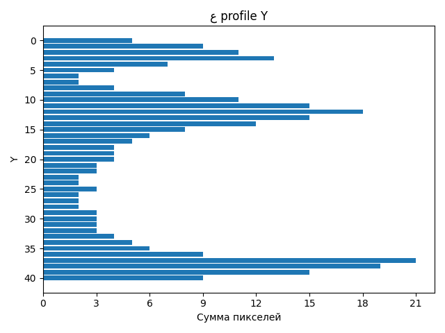

---

### Символ 17 — ف

**Изображение символа:**

**Скалярные характеристики:**

| Признак | Значение |
|---|---:|
| Вес 1-й четверти | 3 |
| Вес 2-й четверти | 36 |
| Вес 3-й четверти | 92 |
| Вес 4-й четверти | 156 |
| Удельный вес 1-й четверти | 0.010714 |
| Удельный вес 2-й четверти | 0.128571 |
| Удельный вес 3-й четверти | 0.328571 |
| Удельный вес 4-й четверти | 0.557143 |
| Координата центра тяжести X | 24.331010 |
| Координата центра тяжести Y | 20.560976 |
| Нормированная координата X | 0.623872 |
| Нормированная координата Y | 0.761518 |
| Осевой момент инерции Ix | 12774.682927 |
| Осевой момент инерции Iy | 44435.554007 |
| Нормированный момент инерции Ix | 11.405967 |
| Нормированный момент инерции Iy | 39.674602 |

**Профиль X:**

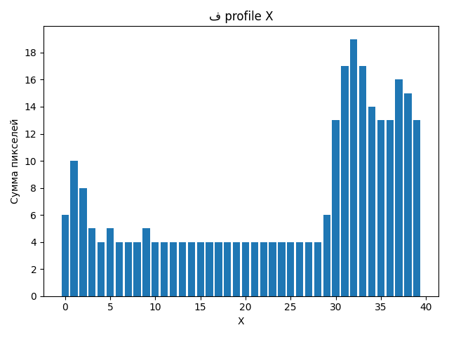

**Профиль Y:**

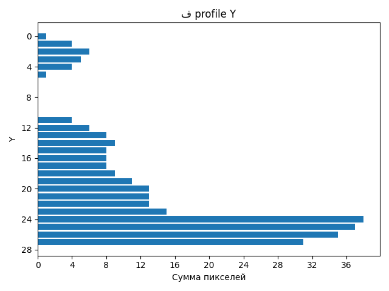

---

### Символ 18 — ص

**Изображение символа:**

**Скалярные характеристики:**

| Признак | Значение |
|---|---:|
| Вес 1-й четверти | 44 |
| Вес 2-й четверти | 162 |
| Вес 3-й четверти | 119 |
| Вес 4-й четверти | 56 |
| Удельный вес 1-й четверти | 0.125356 |
| Удельный вес 2-й четверти | 0.445055 |
| Удельный вес 3-й четверти | 0.339031 |
| Удельный вес 4-й четверти | 0.153846 |
| Координата центра тяжести X | 30.175853 |
| Координата центра тяжести Y | 12.301837 |
| Нормированная координата X | 0.558812 |
| Нормированная координата Y | 0.492073 |
| Осевой момент инерции Ix | 18482.288714 |
| Осевой момент инерции Iy | 110701.217848 |
| Нормированный момент инерции Ix | 12.924677 |
| Нормированный момент инерции Iy | 77.413439 |

**Профиль X:**

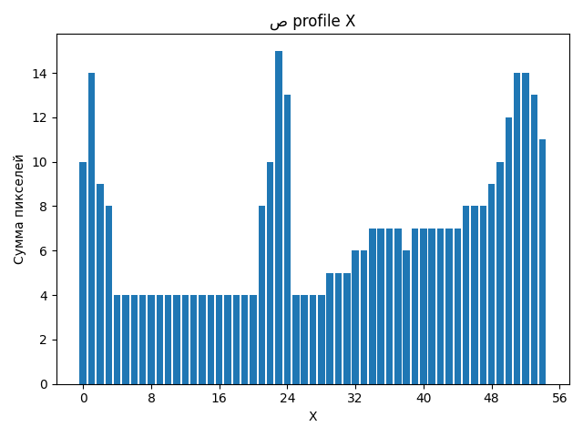

**Профиль Y:**

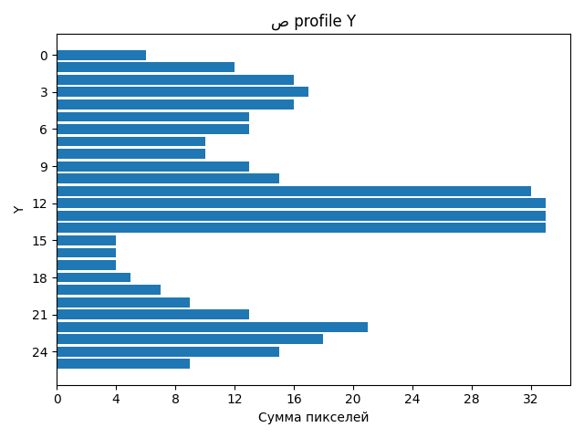

---

### Символ 19 — ق

**Изображение символа:**

**Скалярные характеристики:**

| Признак | Значение |
|---|---:|
| Вес 1-й четверти | 2 |
| Вес 2-й четверти | 91 |
| Вес 3-й четверти | 78 |
| Вес 4-й четверти | 116 |
| Удельный вес 1-й четверти | 0.007143 |
| Удельный вес 2-й четверти | 0.325000 |
| Удельный вес 3-й четверти | 0.278571 |
| Удельный вес 4-й четверти | 0.414286 |
| Координата центра тяжести X | 16.777003 |
| Координата центра тяжести Y | 24.425087 |
| Нормированная координата X | 0.621370 |
| Нормированная координата Y | 0.626284 |
| Осевой момент инерции Ix | 38186.139373 |
| Осевой момент инерции Iy | 19641.728223 |
| Нормированный момент инерции Ix | 34.094767 |
| Нормированный момент инерции Iy | 17.537257 |

**Профиль X:**

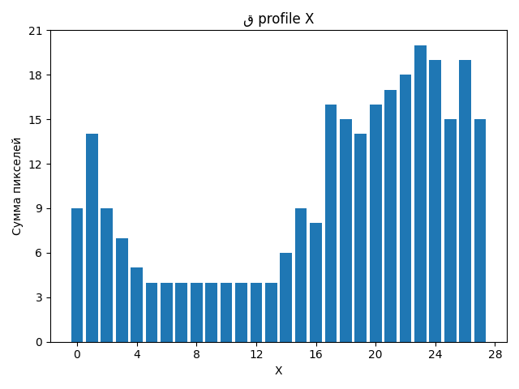

**Профиль Y:**

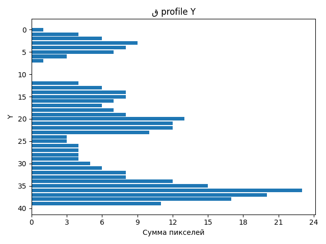

---

### Символ 20 — ر

**Изображение символа:**

**Скалярные характеристики:**

| Признак | Значение |
|---|---:|
| Вес 1-й четверти | 0 |
| Вес 2-й четверти | 33 |
| Вес 3-й четверти | 23 |
| Вес 4-й четверти | 59 |
| Удельный вес 1-й четверти | 0.000000 |
| Удельный вес 2-й четверти | 0.211538 |
| Удельный вес 3-й четверти | 0.149351 |
| Удельный вес 4-й четверти | 0.351190 |
| Координата центра тяжести X | 15.800000 |
| Координата центра тяжести Y | 16.800000 |
| Нормированная координата X | 0.718182 |
| Нормированная координата Y | 0.646154 |
| Осевой момент инерции Ix | 7380.400000 |
| Осевой момент инерции Iy | 3884.400000 |
| Нормированный момент инерции Ix | 11.884702 |
| Нормированный момент инерции Iy | 6.255072 |

**Профиль X:**

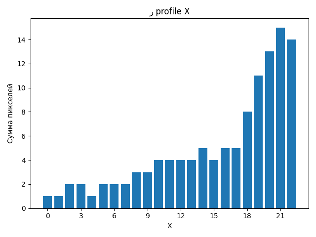

**Профиль Y:**

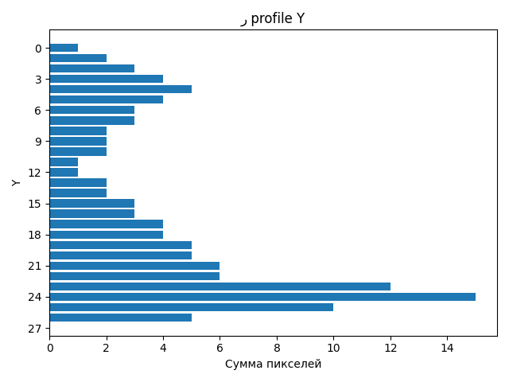

---

### Символ 21 — ش

**Изображение символа:**

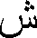

**Скалярные характеристики:**

| Признак | Значение |
|---|---:|
| Вес 1-й четверти | 1 |
| Вес 2-й четверти | 84 |
| Вес 3-й четверти | 104 |
| Вес 4-й четверти | 127 |
| Удельный вес 1-й четверти | 0.002381 |
| Удельный вес 2-й четверти | 0.190476 |
| Удельный вес 3-й четверти | 0.247619 |
| Удельный вес 4-й четверти | 0.287982 |
| Координата центра тяжести X | 22.803797 |
| Координата центра тяжести Y | 25.905063 |
| Нормированная координата X | 0.570095 |
| Нормированная координата Y | 0.631831 |
| Осевой момент инерции Ix | 40267.151899 |
| Осевой момент инерции Iy | 47763.835443 |
| Нормированный момент инерции Ix | 23.383944 |
| Нормированный момент инерции Iy | 27.737419 |

**Профиль X:**

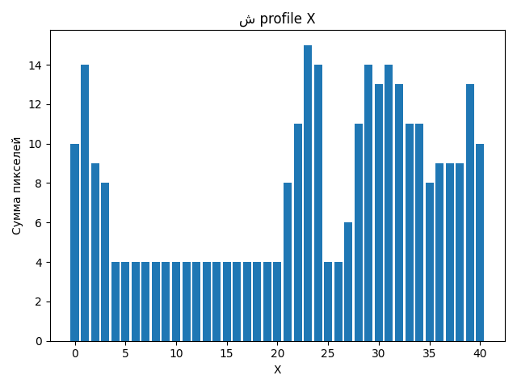

**Профиль Y:**

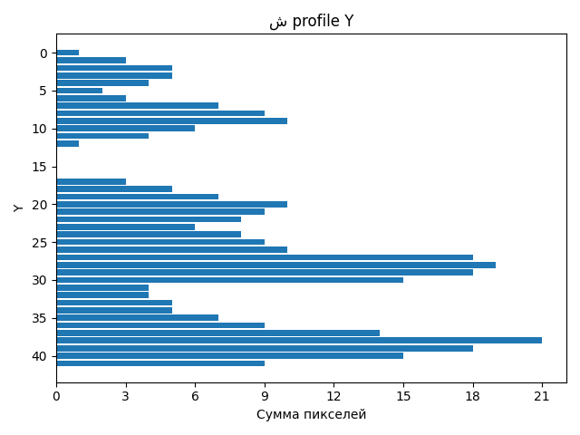

---

### Символ 22 — ت

**Изображение символа:**

**Скалярные характеристики:**

| Признак | Значение |
|---|---:|
| Вес 1-й четверти | 25 |
| Вес 2-й четверти | 29 |
| Вес 3-й четверти | 80 |
| Вес 4-й четверти | 95 |
| Удельный вес 1-й четверти | 0.115741 |
| Удельный вес 2-й четверти | 0.134259 |
| Удельный вес 3-й четверти | 0.341880 |
| Удельный вес 4-й четверти | 0.405983 |
| Координата центра тяжести X | 19.004367 |
| Координата центра тяжести Y | 17.104803 |
| Нормированная координата X | 0.542982 |
| Нормированная координата Y | 0.712700 |
| Осевой момент инерции Ix | 12447.484716 |
| Осевой момент инерции Iy | 26330.995633 |
| Нормированный момент инерции Ix | 13.830539 |
| Нормированный момент инерции Iy | 29.256662 |

**Профиль X:**

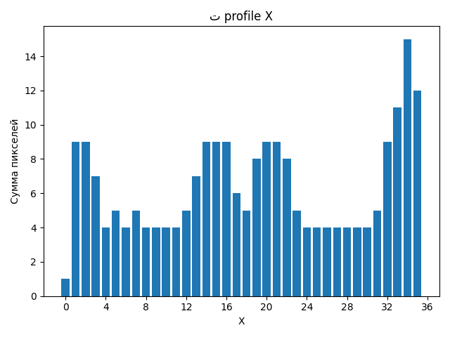

**Профиль Y:**

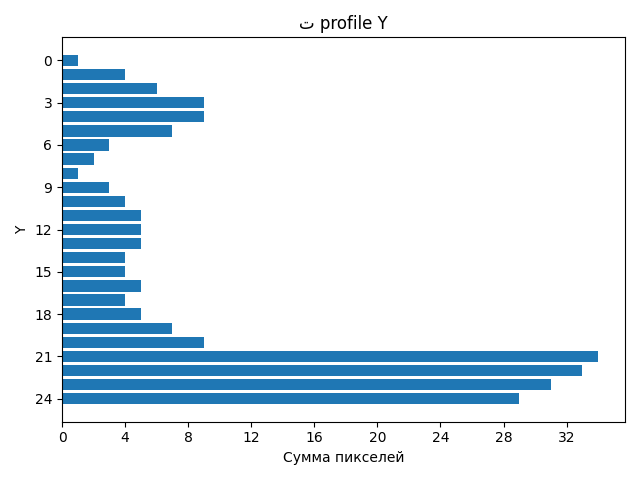

---

### Символ 23 — ث

**Изображение символа:**

**Скалярные характеристики:**

| Признак | Значение |
|---|---:|
| Вес 1-й четверти | 42 |
| Вес 2-й четверти | 23 |
| Вес 3-й четверти | 82 |
| Вес 4-й четверти | 102 |
| Удельный вес 1-й четверти | 0.155556 |
| Удельный вес 2-й четверти | 0.085185 |
| Удельный вес 3-й четверти | 0.303704 |
| Удельный вес 4-й четверти | 0.377778 |
| Координата центра тяжести X | 18.722892 |
| Координата центра тяжести Y | 20.530120 |
| Нормированная координата X | 0.534940 |
| Нормированная координата Y | 0.707935 |
| Осевой момент инерции Ix | 19550.024096 |
| Осевой момент инерции Iy | 26589.879518 |
| Нормированный момент инерции Ix | 18.101874 |
| Нормированный момент инерции Iy | 24.620259 |

**Профиль X:**

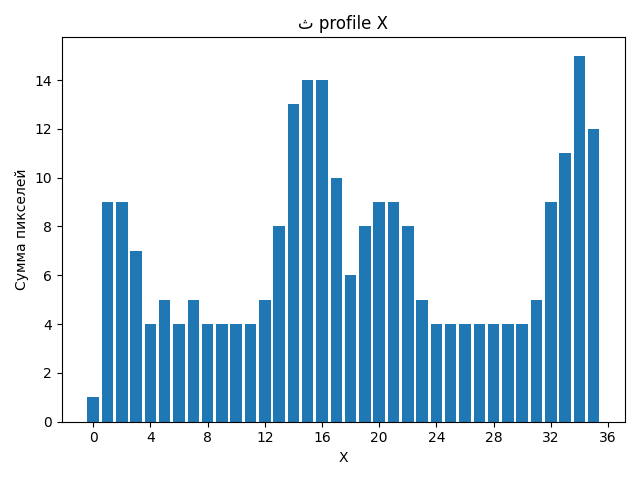

**Профиль Y:**

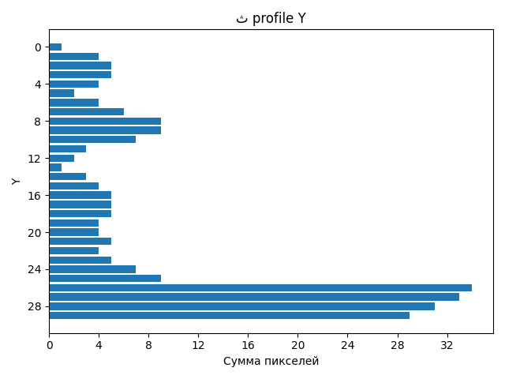

---

### Символ 24 — خ

**Изображение символа:**

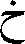

**Скалярные характеристики:**

| Признак | Значение |
|---|---:|
| Вес 1-й четверти | 67 |
| Вес 2-й четверти | 81 |
| Вес 3-й четверти | 73 |
| Вес 4-й четверти | 46 |
| Удельный вес 1-й четверти | 0.253788 |
| Удельный вес 2-й четверти | 0.283217 |
| Удельный вес 3-й четверти | 0.276515 |
| Удельный вес 4-й четверти | 0.160839 |
| Координата центра тяжести X | 10.913858 |
| Координата центра тяжести Y | 23.640449 |
| Нормированная координата X | 0.454744 |
| Нормированная координата Y | 0.549778 |
| Осевой момент инерции Ix | 48507.483146 |
| Осевой момент инерции Iy | 10601.018727 |
| Нормированный момент инерции Ix | 44.097712 |
| Нормированный момент инерции Iy | 9.637290 |

**Профиль X:**

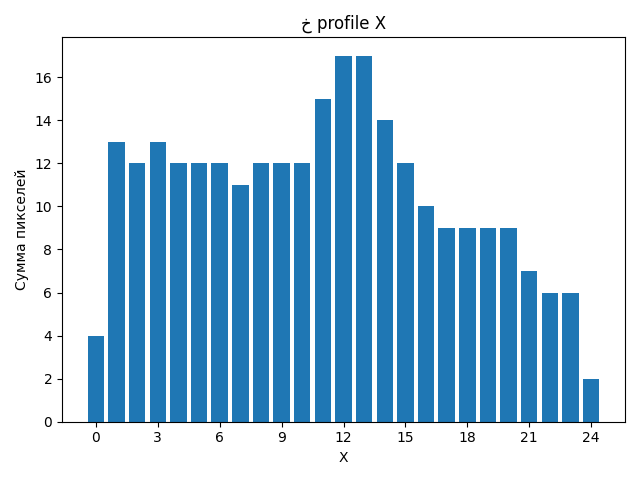

**Профиль Y:**

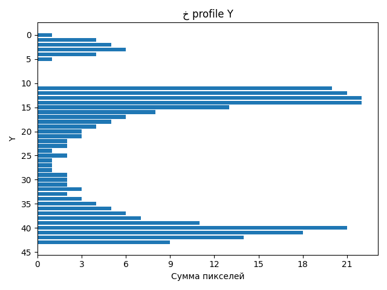

---

### Символ 25 — ذ

**Изображение символа:**

**Скалярные характеристики:**

| Признак | Значение |
|---|---:|
| Вес 1-й четверти | 20 |
| Вес 2-й четверти | 11 |
| Вес 3-й четверти | 31 |
| Вес 4-й четверти | 57 |
| Удельный вес 1-й четверти | 0.166667 |
| Удельный вес 2-й четверти | 0.091667 |
| Удельный вес 3-й четверти | 0.242188 |
| Удельный вес 4-й четверти | 0.445312 |
| Координата центра тяжести X | 8.369748 |
| Координата центра тяжести Y | 20.537815 |
| Нормированная координата X | 0.557983 |
| Нормированная координата Y | 0.684594 |
| Осевой момент инерции Ix | 11799.579832 |
| Осевой момент инерции Iy | 2085.731092 |
| Нормированный момент инерции Ix | 23.789475 |
| Нормированный момент инерции Iy | 4.205103 |

**Профиль X:**

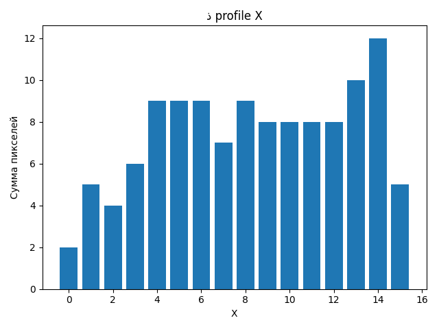

**Профиль Y:**

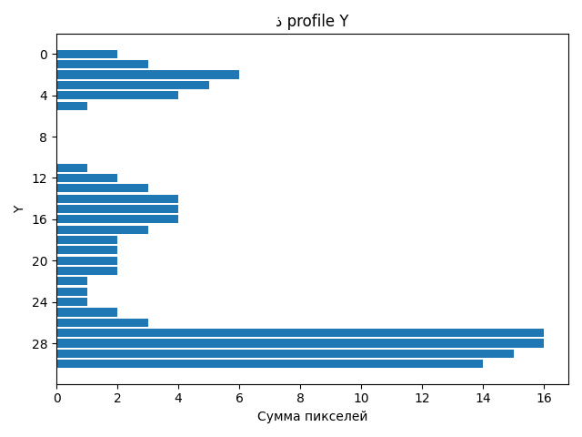

---

### Символ 26 — ض

**Изображение символа:**

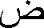

**Скалярные характеристики:**

| Признак | Значение |
|---|---:|
| Вес 1-й четверти | 25 |
| Вес 2-й четверти | 100 |
| Вес 3-й четверти | 138 |
| Вес 4-й четверти | 140 |
| Удельный вес 1-й четверти | 0.054466 |
| Удельный вес 2-й четверти | 0.210084 |
| Удельный вес 3-й четверти | 0.283951 |
| Удельный вес 4-й четверти | 0.277778 |
| Координата центра тяжести X | 30.421836 |
| Координата центра тяжести Y | 20.282878 |
| Нормированная координата X | 0.563367 |
| Нормированная координата Y | 0.596555 |
| Осевой момент инерции Ix | 25767.751861 |
| Осевой момент инерции Iy | 111164.287841 |
| Нормированный момент инерции Ix | 13.385845 |
| Нормированный момент инерции Iy | 57.747682 |

**Профиль X:**

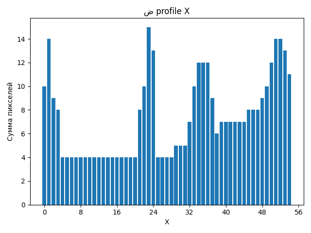

**Профиль Y:**

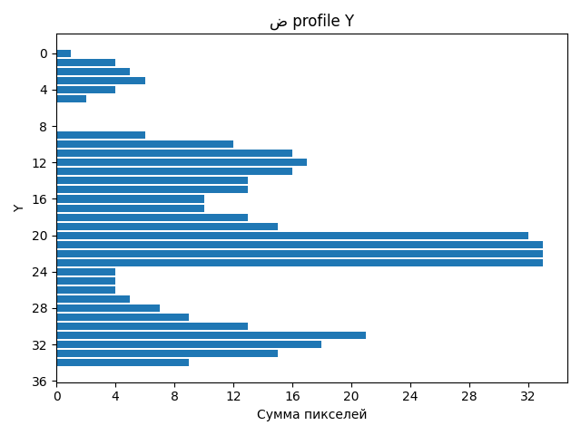

---

### Символ 27 — ظ

**Изображение символа:**

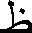

**Скалярные характеристики:**

| Признак | Значение |
|---|---:|
| Вес 1-й четверти | 51 |
| Вес 2-й четверти | 21 |
| Вес 3-й четверти | 103 |
| Вес 4-й четверти | 140 |
| Удельный вес 1-й четверти | 0.199219 |
| Удельный вес 2-й четверти | 0.082031 |
| Удельный вес 3-й четверти | 0.378676 |
| Удельный вес 4-й четверти | 0.514706 |
| Координата центра тяжести X | 17.063492 |
| Координата центра тяжести Y | 22.641270 |
| Нормированная координата X | 0.550435 |
| Нормированная координата Y | 0.707540 |
| Осевой момент инерции Ix | 26322.463492 |
| Осевой момент инерции Iy | 21096.730159 |
| Нормированный момент инерции Ix | 24.926575 |
| Нормированный момент инерции Iy | 19.977964 |

**Профиль X:**

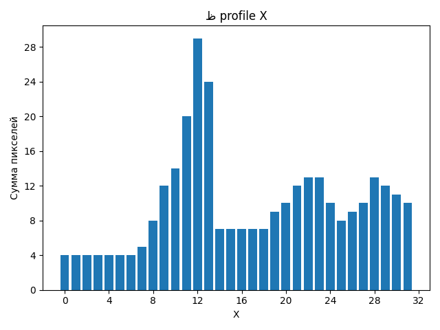

**Профиль Y:**

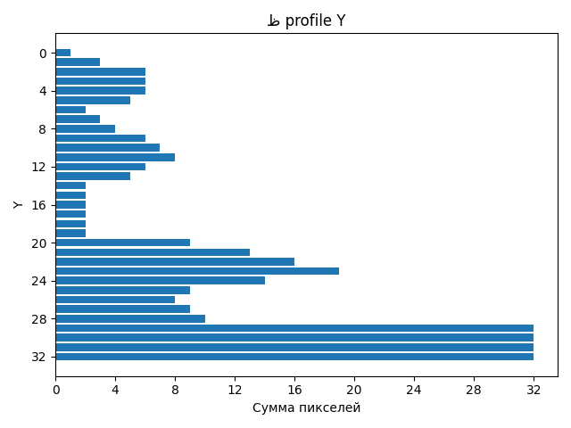

---

### Символ 28 — غ

**Изображение символа:**

**Скалярные характеристики:**

| Признак | Значение |
|---|---:|
| Вес 1-й четверти | 114 |
| Вес 2-й четверти | 41 |
| Вес 3-й четверти | 106 |
| Вес 4-й четверти | 44 |
| Удельный вес 1-й четверти | 0.365385 |
| Удельный вес 2-й четверти | 0.121302 |
| Удельный вес 3-й четверти | 0.339744 |
| Удельный вес 4-й четверти | 0.130178 |
| Координата центра тяжести X | 8.380328 |
| Координата центра тяжести Y | 29.272131 |
| Нормированная координата X | 0.349180 |
| Нормированная координата Y | 0.573963 |
| Осевой момент инерции Ix | 65556.413115 |
| Осевой момент инерции Iy | 10177.881967 |
| Нормированный момент инерции Ix | 50.428010 |
| Нормированный момент инерции Iy | 7.829140 |

**Профиль X:**

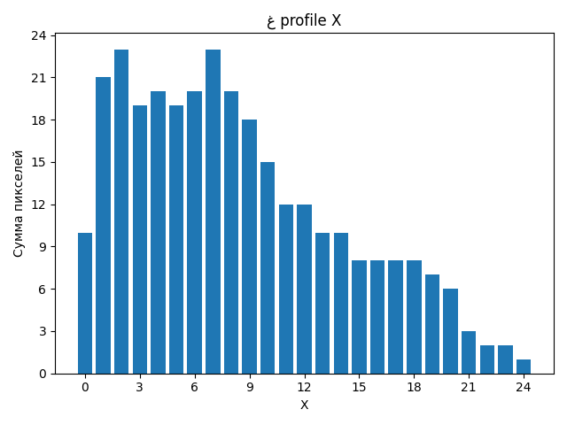

**Профиль Y:**

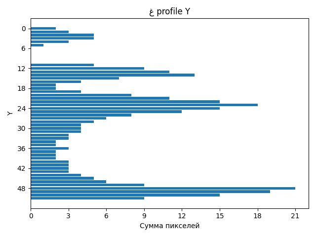

---

