# Лабораторная работа №6

## Сегментация текста

**Вариант:** 1  
**Алфавит:** арабский

---

## Исходное изображение

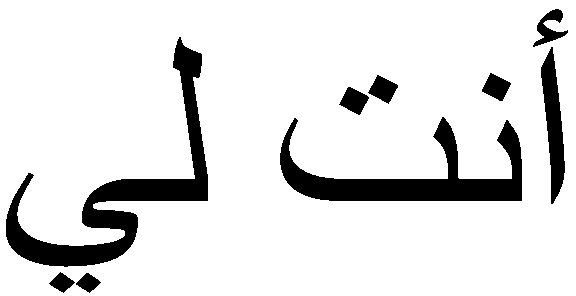

---

## Горизонтальный профиль всего изображения

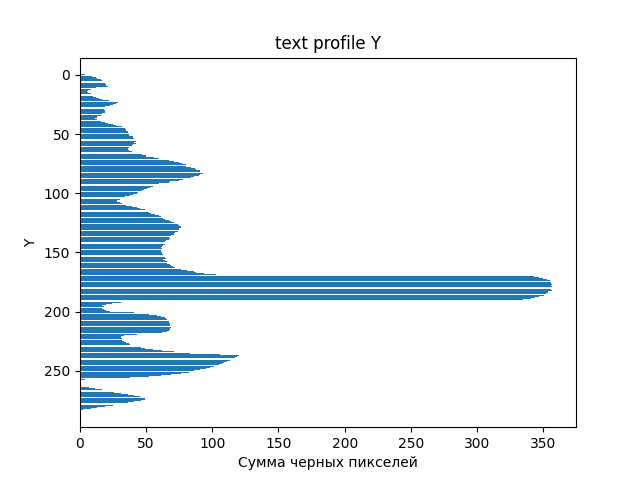

---

## Вертикальный профиль всего изображения

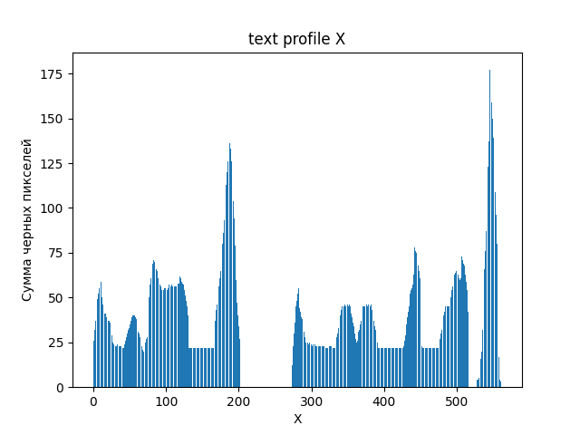

---

## Профили символов алфавита

Профили эталонных символов из ЛР5 сохранены в папке `alphabet_profiles`.

---

## Символ 1

### Изображение

### Профиль X
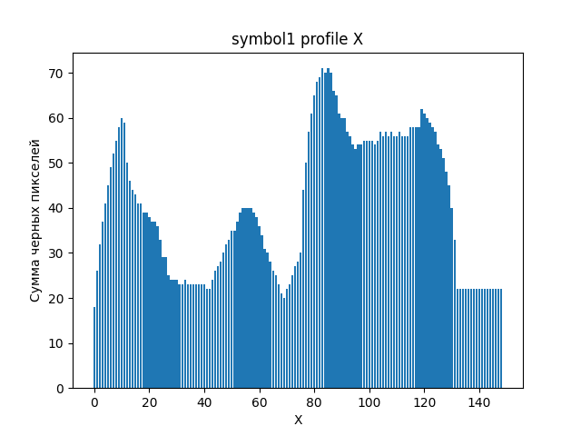

### Профиль Y
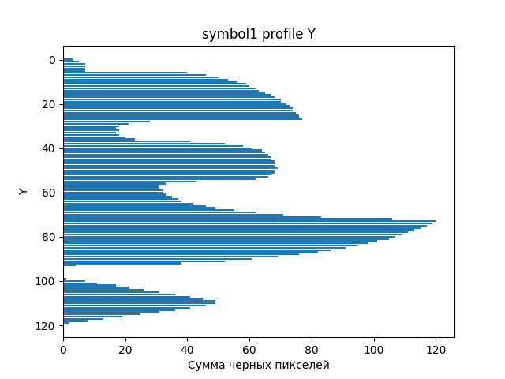

---

## Символ 2

### Изображение

### Профиль X
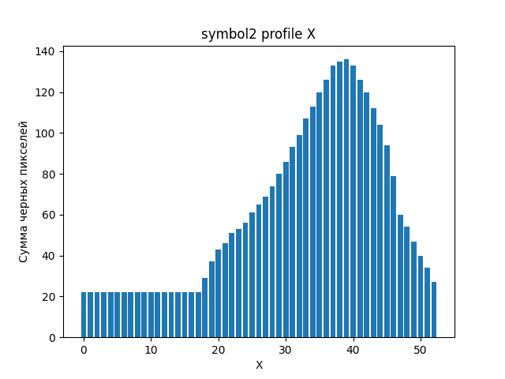

### Профиль Y
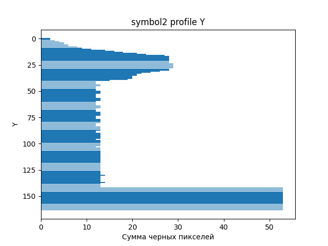

---

## Символ 3

### Изображение

### Профиль X
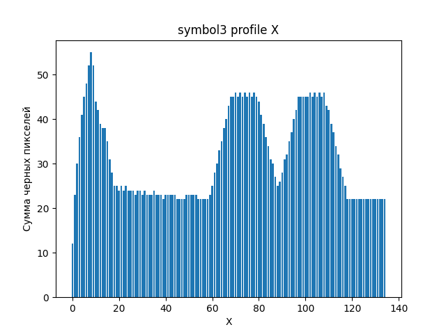

### Профиль Y
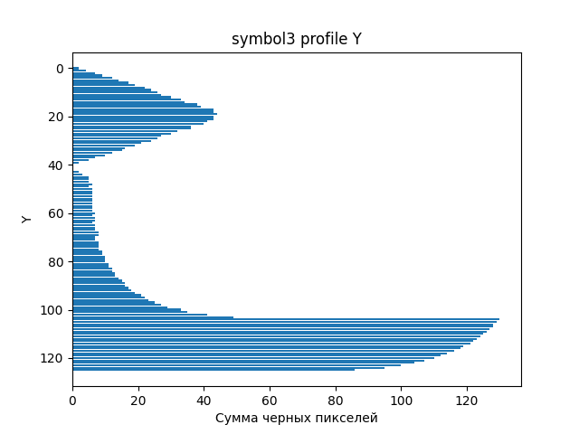

---

## Символ 4

### Изображение

### Профиль X
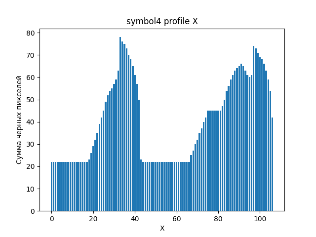

### Профиль Y
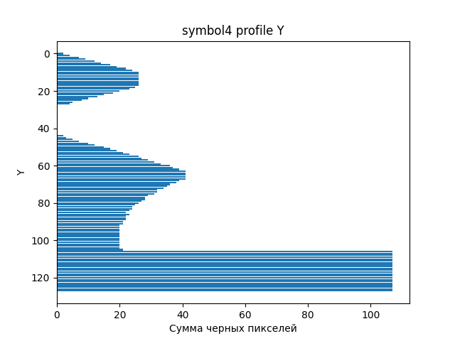

---

## Символ 5

### Изображение

### Профиль X
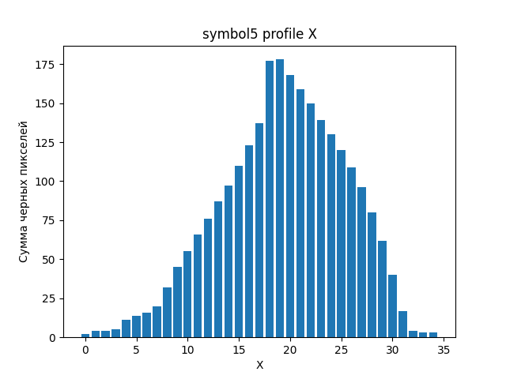

### Профиль Y
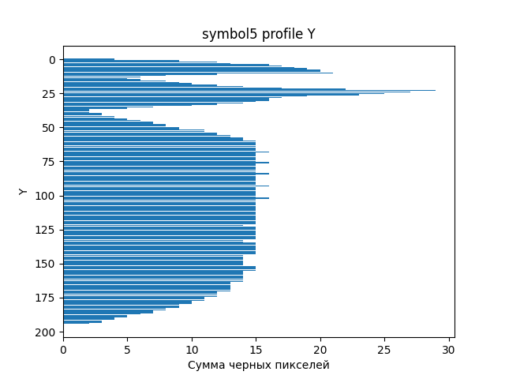

---
