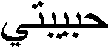
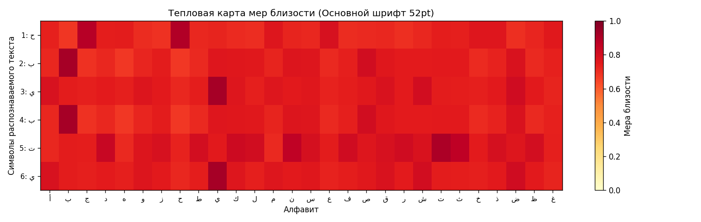
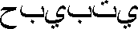
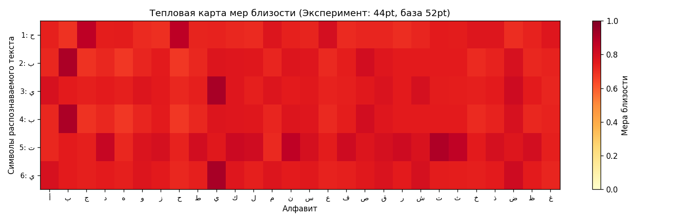
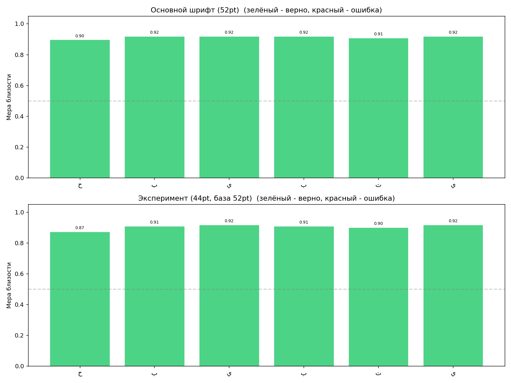

# Лабораторная работа №7

## Классификация на основе признаков, анализ профилей

**Вариант 1**  
**Алфавит:** арабский  
**Шрифт:** Times New Roman, 52 и 44  
**Распознаваемое слово:** `ح ب ي ب ت ي`

### Цель работы

Реализовать расчет меры близости изображений символов на основе признаков, распознать строку и сравнить результат с исходной последовательностью символов.

---

## Эксперимент 1. Основной шрифт 52pt

### Исходная строка

### Результат распознавания

Распознанная последовательность: `ح ب ي ب ت ي`  
Эталонная последовательность: `ح ب ي ب ت ي`  
Количество ошибок: `0`  
Точность: `100.0%`

### Тепловая карта мер близости

Гипотезы сохранены в файл `hypotheses_main.txt`.

---

## Эксперимент 2. Шрифт 44pt

### Исходная строка

### Результат распознавания

Распознанная последовательность: `ح ب ي ب ت ي`  
Эталонная последовательность: `ح ب ي ب ت ي`  
Количество ошибок: `0`  
Точность: `100.0%`

### Тепловая карта мер близости

Гипотезы сохранены в файл `hypotheses_experiment.txt`.

---

## Сравнение

## Вывод

Для распознавания использовались скалярные признаки символов и нормированные профили по осям X и Y. Добавление профильных признаков позволило различить похожие арабские буквы с разным количеством и положением точек. Для обоих кеглей слово распознано без ошибок.
