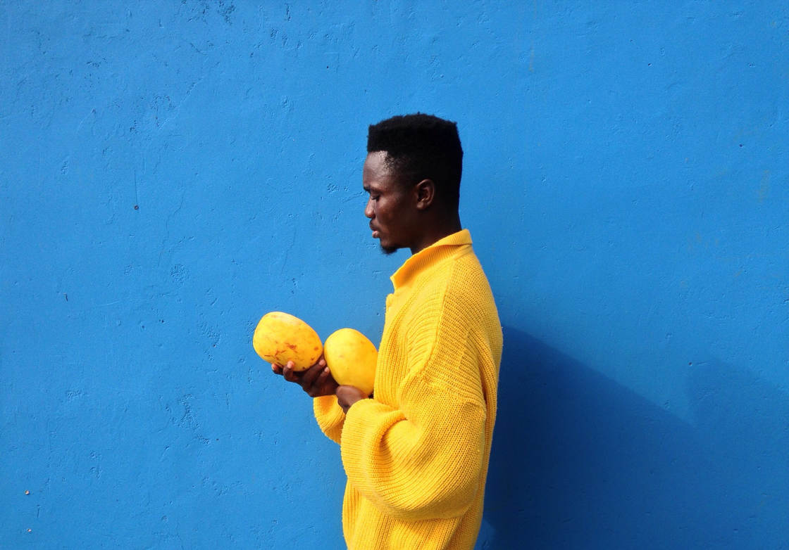
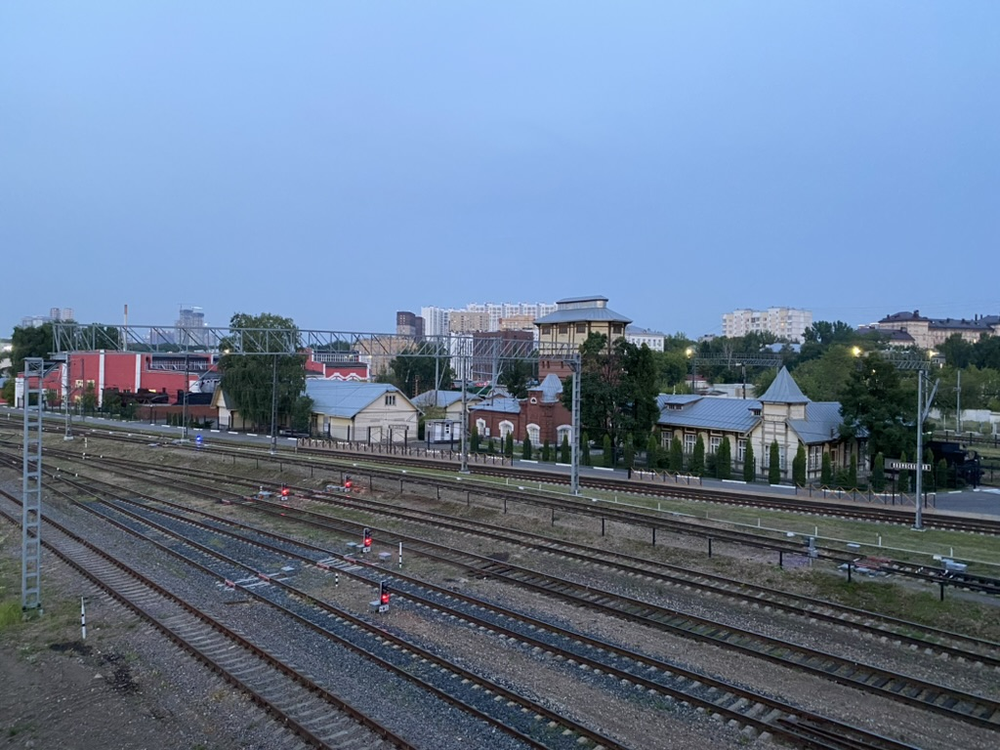
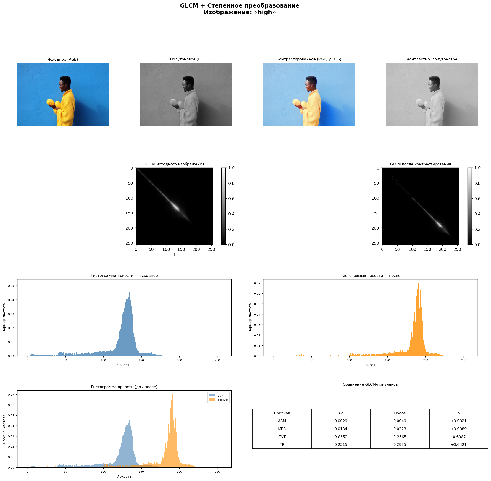
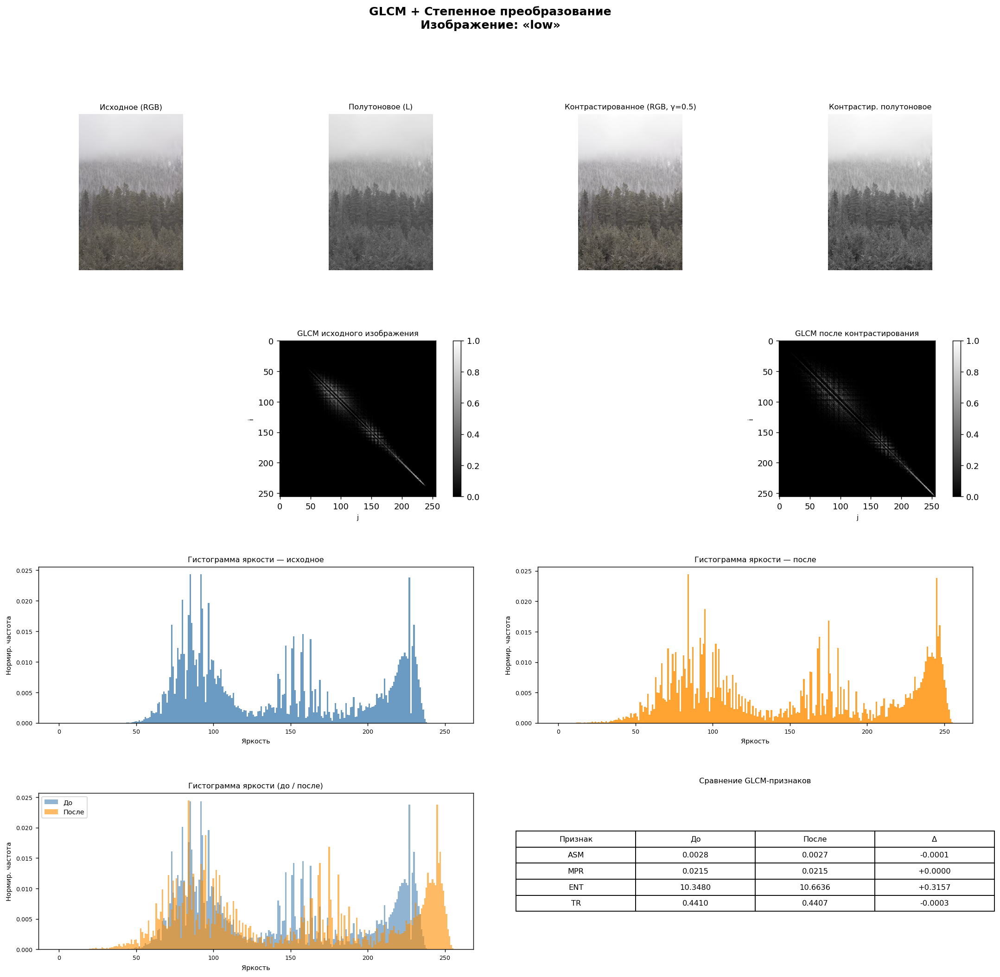
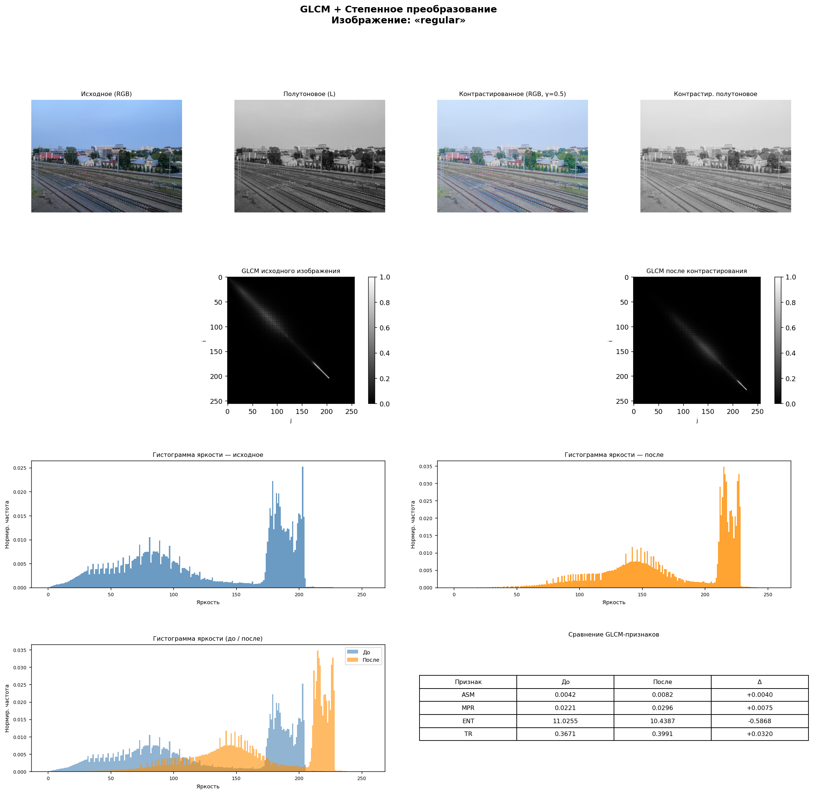
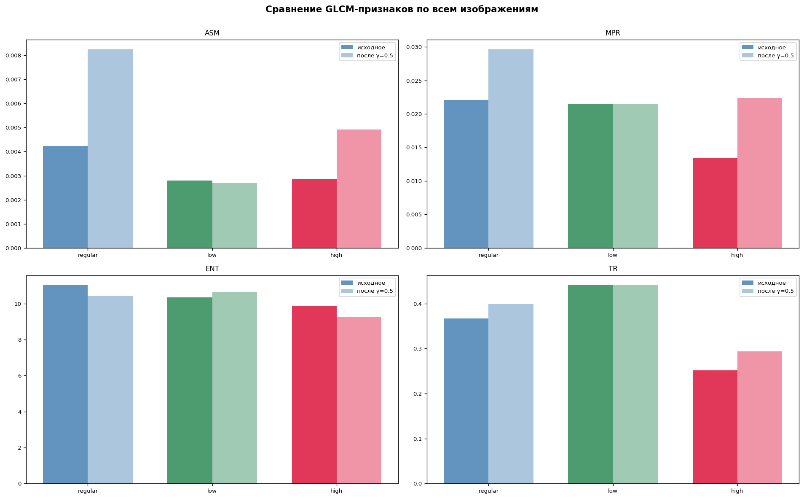

# Лабораторная работа №8

---

## Текстурный анализ и контрастирование

---

**Вариант 1**

---

### Цель работы

Построить матрицу GLCM для разных изображений, рассчитать признаки ASM, MPR, ENT и TR, применить степенное преобразование яркости к исходным изображениям, рассчитать гистограммы до и после преобразования, сравнить текстурные признаки для исходных и контрастированных изображений.

---

## Исходные изображения

### Высоконтрастное изображение

### Низкоконтрастное изображение

### Обычное изображение

---

## Результаты

### Высоконтрастное изображение

### Низкоконтрастное изображение

### Обычное изображение

### Сравнение по всем изображениям

---

## Вывод

В данной лабораторной работе:
- Реализован метод анализа текстур GLCM для расстояния d=1 и направлений 0, 90, 180, 270
- Рассчитаны признаки ASM, MPR, ENT и TR
- Выполнено степенное преобразование яркости полутонового изображения
- Проанализированы изменения гистограмм яркости и GLCM-признаков
- Проведено сравнение по всем изображениям
