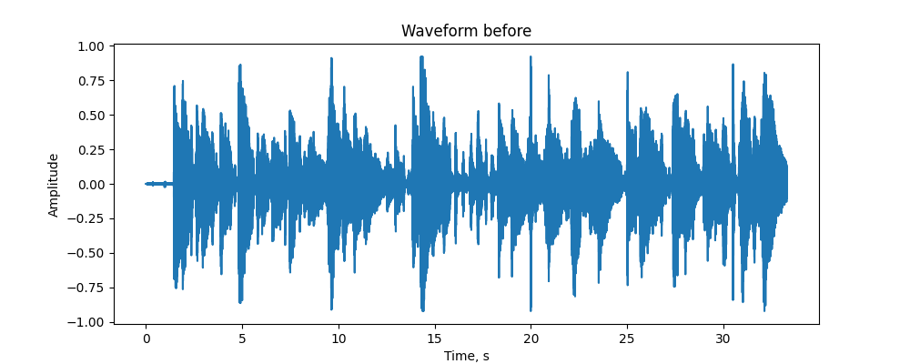
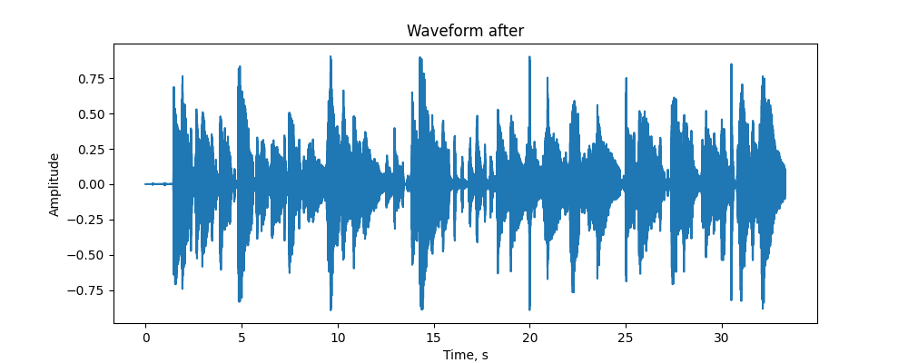
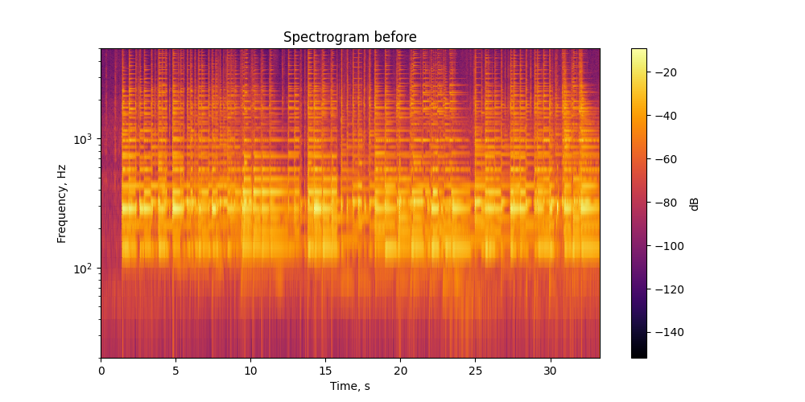
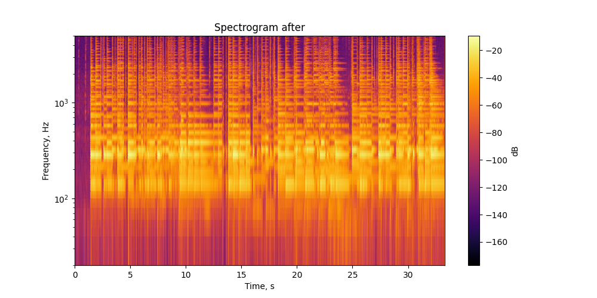

# Лабораторная работа №9

## Анализ шума

### Цель работы

Исследовать шум в аудиозаписи музыкального инструмента, построить спектрограмму сигнала, оценить уровень шума, выполнить его подавление и определить моменты времени, в которых энергия сигнала максимальна в заданных временных и частотных окрестностях.

### Исходные данные

В качестве исходных данных использовалась аудиозапись гитары в формате `.wav`.

Аудиозапись одноканальная, частота дискретизации составляет `48000 Гц`, длительность записи - `33.3 с`.

## Осциллограммы сигнала

### Исходный сигнал:

### Сигнал после подавления шума:

---

## Спектрограммы сигнала

### Спектрограмма до обработки:

### Спектрограмма после обработки:

---

## Оценка уровня шума

В ходе работы были получены следующие результаты:

* **SNR до обработки:** `~20,29 dB`
* **SNR после обработки:** `~19,71 dB`

После применения спектрального вычитания отношение сигнал/шум немного снизилось. Это может быть связано с тем, что вместе с шумом были частично ослаблены компоненты полезного сигнала гитары, а также появились артефакты обработки.

При этом на спектрограмме после обработки заметно уменьшение части слабых фоновых составляющих. Для данной записи исходный сигнал уже достаточно выражен, поэтому сильное подавление шума может ухудшать количественную оценку.

---

## Моменты времени с максимальной энергией

Были найдены временные интервалы и частотные полосы, в которых энергия сигнала максимальна.

### Наиболее энергетически выраженные участки

1. `t = [14.3; 14.4] c`, `f = [280; 330] Гц`, `E ≈ 0.047`
2. `t = [4.9; 5.0] c`, `f = [280; 330] Гц`, `E ≈ 0.040`
3. `t = [30.5; 30.6] c`, `f = [300; 350] Гц`, `E ≈ 0.039`
4. `t = [14.4; 14.5] c`, `f = [280; 330] Гц`, `E ≈ 0.039`
5. `t = [5.0; 5.1] c`, `f = [280; 330] Гц`, `E ≈ 0.035`

Полный список найденных максимумов был сохранён в файл:

`./output/energy_peaks.csv`

---

## Восстановленный аудиофайл

После подавления шума был сохранён восстановленный аудиосигнал:

`./output/denoised.wav`

---

## Вывод

В ходе лабораторной работы были исследованы методы анализа и подавления шума в аудиосигнале.

Реализовано построение спектрограммы с окном Ханна, оценка спектра шума, подавление шума методом спектрального вычитания и анализ энергетических характеристик сигнала.
